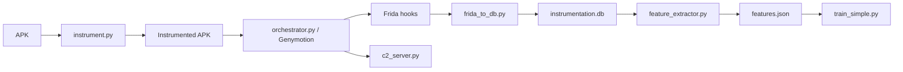

# Android Instrumentor

Turnkey framework for instrumenting Android APKs, running them in **Genymotion**, capturing behavioral telemetry (Frida + optional smali hooks), extracting ML features, and training a classifier.

## Quick Start (Genymotion)

```bash
# 1) Setup Python env + tools
./setup.sh
source venv/bin/activate

# 2) Ensure Genymotion is installed and a VM exists
#    Default VM name: "Genymotion Phone"
#    gmtool: ~/Documents/Tools/genymotion/gmtool

# 3) Run full pipeline
./run_pipeline.sh ./research-app.apk --label research:benign
```

Results land in `results/<apk-name>/`:

- `instrumented/` — rebuilt APK
- `traces/` — `latest_trace.json`, `instrumentation.db`, Frida logs
- `features.json` — ML feature vector(s)
- `model_rf.pkl` — RandomForest smoke model (optional)
- `pipeline_meta.json` — stage status

## Architecture



## Components

| Module | Role |
|--------|------|
| `instrument.py` | apktool decompile, inject service/hooks, recompile, sign |
| `orchestrator.py` | Genymotion start, install, exercise, Frida, pull logs |
| `frida_hooks.js` | Dynamic API/network/file/telephony capture |
| `frida_to_db.py` | Convert Frida JSONL → SQLite schema |
| `feature_extractor.py` | Behavioral features for ML |
| `train_simple.py` | RandomForest trainer (honest defaults) |
| `train_model.py` | Optional LSTM path (needs TensorFlow) |
| `c2_server.py` | Research C2 + dashboard |
| `pipeline.py` / `run_pipeline.sh` | One-shot end-to-end runner |
| `pre_flight_check.py` | Tooling/VM readiness |

## Configuration

Edit `config.yaml`:

```yaml
emulator:
  backend: genymotion
  vm_name: Genymotion Phone
paths:
  gmtool: ~/Documents/Tools/genymotion/gmtool
  genymotion: ~/Documents/Tools/genymotion
analysis:
  frida_enabled: true
  frida_duration: 45
  monkey_events: 50
```

Environment overrides: `GMTOOL`, `GENYMOTION_HOME`, `ADB_SERIAL`, `ANDROID_HOME`, `STOP_EMULATOR=1`.

## Manual stage commands

```bash
python instrument.py ./app.apk -o ./output
python orchestrator.py ./output/instrumented-app.apk --backend genymotion --vm "Genymotion Phone"
python frida_to_db.py ./output/traces/frida_events.jsonl -o ./output/traces/instrumentation.db
python feature_extractor.py ./output/traces/instrumentation.db -o features.json
python train_simple.py --features features.json --output model_rf.pkl
python c2_server.py --port 5000
```

## Frida on Genymotion

For full Frida attach/spawn you typically need `frida-server` matching your Frida version on the VM:

```bash
# on host, after identifying arch (arm64/x86_64):
adb connect 127.0.0.1:6554
adb push frida-server /data/local/tmp/frida-server
adb shell chmod 755 /data/local/tmp/frida-server
adb shell /data/local/tmp/frida-server &
```

Without frida-server, the pipeline still runs smali instrumentation + adb analysis commands.

## Tests

```bash
source venv/bin/activate
python -m pytest -q
# or
python -m unittest discover -s tests -v
```

## Troubleshooting

- **gmtool not found** — set `paths.gmtool` or `export GMTOOL=~/Documents/Tools/genymotion/gmtool`
- **VM off** — pipeline starts `Genymotion Phone` automatically via gmtool
- **Install fails** — ensure VM is booted (`gmtool admin list`) and adb sees serial
- **Empty Frida logs** — push matching `frida-server` to the VM
- **Synthetic training warning** — expected with <4 labeled samples; collect a real corpus for serious metrics

## License

MIT — research and experimentation only. Use only on systems/apps you are authorized to analyze.
